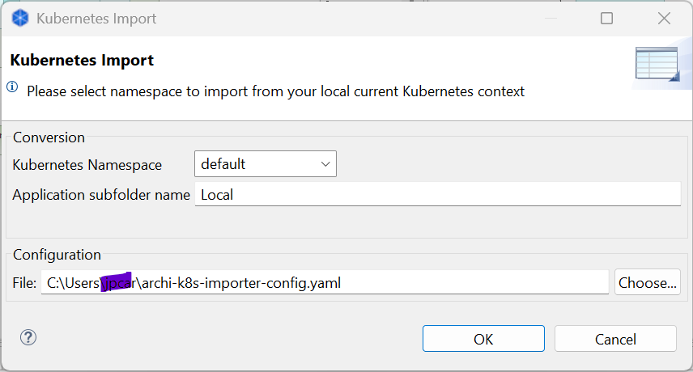
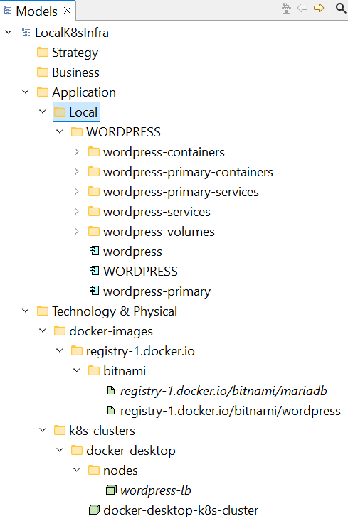
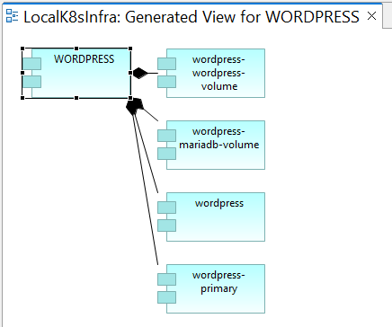
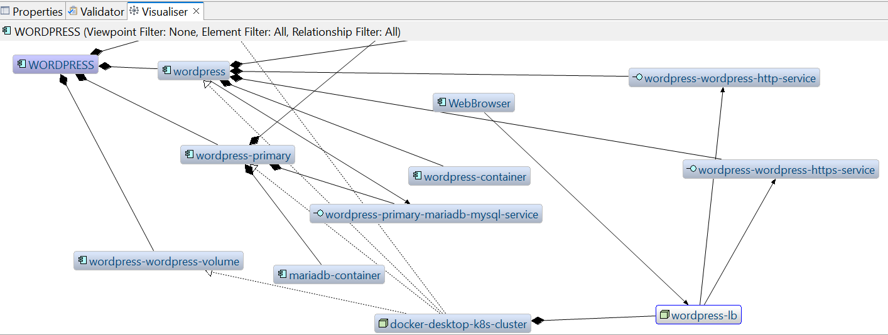
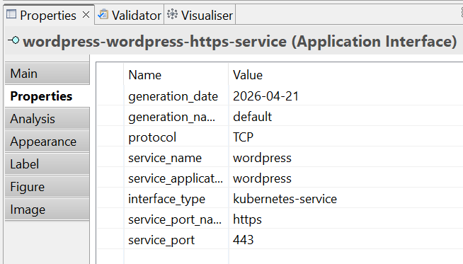
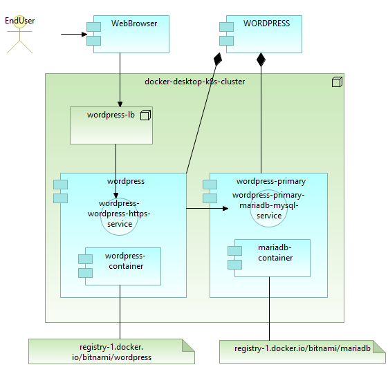

# K8S Importer

This is an extension to [Archi](https://www.archimatetool.com/) that import Kubernetes cluster deployment data into an Archi model. 

The source code for K8sImporter is freely available at GitHub, with a ready-to-go drop-in Archi plug-in of first release. Latest releases
with additional resources will be available for contributors.

Kubernetes to Archi conversion choices are described in [Archimate Community Discussion on Archimate and Kubernetes concepts mapping](https://community.opengroup.org/archimate-community/home/-/issues/102) and this [Google Sheet link](https://docs.google.com/spreadsheets/d/1vwkXa40-TxS_2JogJvwd8W8zHp63_kQuWfzwxYBekWc/edit?usp=sharing).

Please read [archi-k8s-importer-config.yaml](archi-k8s-importer-config.yaml) for more import details, like Kubernetes labels and annotations used for import

Requires Archi 5.7 or later, tested with Kubernetes v1.28.11 or later

## Setup

Download the latest k8s importer plug-in jar file from the [releases](https://github.com/jpca/archi-k8s-importer/releases) page

Close Archi if it is open

Copy the plug-in to Archi's "dropins" folder (if this does not exist you will need to create it)

Relaunch Archi

After relaunching Archi, the plug-in will be listed in Archi from menu Help - Manage Plug-ins...

Note: The default "dropins" folder is located in the following file locations:

- Windows: ~/AppData/Roaming/Archi/dropins
- Mac: ~/Library/Application Support/Archi/dropins
- Linux: ~/.archi/dropins

("~" is the user's home directory)

## Usage

The K8SImporter plugin is based on Kubernetes API.
The computer where Archi is running needs [kubectl](https://kubernetes.io/docs/reference/kubectl/) tool configured to connect to the Kubernetes cluster where you want to import deployment data from.

ie you can from your desktop query pods from the namespace "default". For example
> kubectl get pods --namespace default

*(following examples are based on a [wordpress deployment with bitnami chart](https://github.com/bitnami/charts/tree/main/bitnami/wordpress) and defaults values in a "default" namespace in a Kubernetes cluster launched in [Docker-desktop](https://www.docker.com/products/docker-desktop/) with kubeadm)*

```bash
NAME                         READY   STATUS                       RESTARTS   AGE
wordpress-74c969855d-q5nss   1/1     Running                      0          5h15m
wordpress-mariadb-0          1/1     Running                      0          5h15m
```

Then in Archi, select the model to import into and use the menu File - Import - Import K8s Namespace



In the popup window, you can select a namespace from the list, or type a kubernetes namespace if the list is empty
(the kubernetes administrator can restrict your rights from listing namespaces).
then type the subfolder name in Applications model where you want to import your the namespace deployment information
and click OK.

The import process duration depends on the namespace content and Kubernetes cluster communication bandwitdh but is quite fast.
If no errror appears, browse to the Applications folder and you should see a new subfolder with the name you typed.



You can right click an Application Component in CAPITAL and click Generate View For ...



Or use the Visualiser to dig in the imported elements



You can also check the properties for each concept



and design views as you need



*(here the EndUser and WebBrowser and related links where the only elements created manually, the kubernetes cluster name is based on [archi-k8s-importer-config.yaml](archi-k8s-importer-config.yaml) configuration)*

## Editions

K8sImporter is available in two editions:

- **Free Edition (Open Source)**
  Licensed under Apache 2.0

  → see [FREE-EDITION.md](./FREE-EDITION.md)

  Community contributions like documentation, tests, fixes, new features and improvements are welcome.
  By contributing, you agree that your contributions will be licensed under
  the same Apache 2.0 License.

  → see [CONTRIBUTING.md](./CONTRIBUTING.md)

- **Premium Edition (Commercial)**
  Additional features and support available

## Disclaimer

This plugin is provided as is without warranty. K8s Importer does not use the Archi undo/redo stack to update the model.

You should save your model before and after using K8s Importer to isolate import steps from other model changes.

The use of a version control like [coArchi plugin](https://github.com/archimatetool/archi-modelrepository-plugin) with git is strongly recommended.
